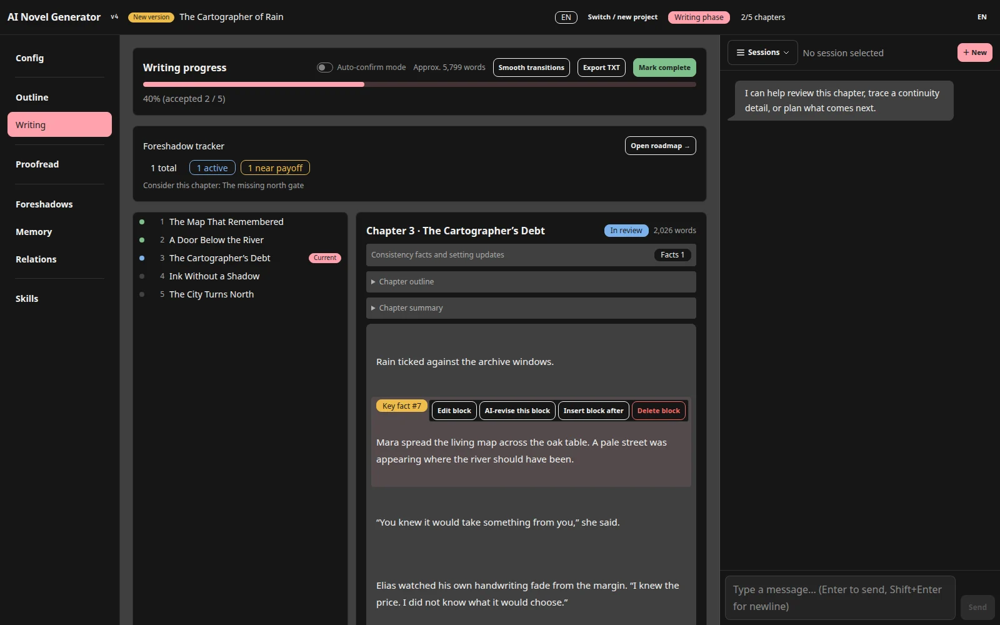
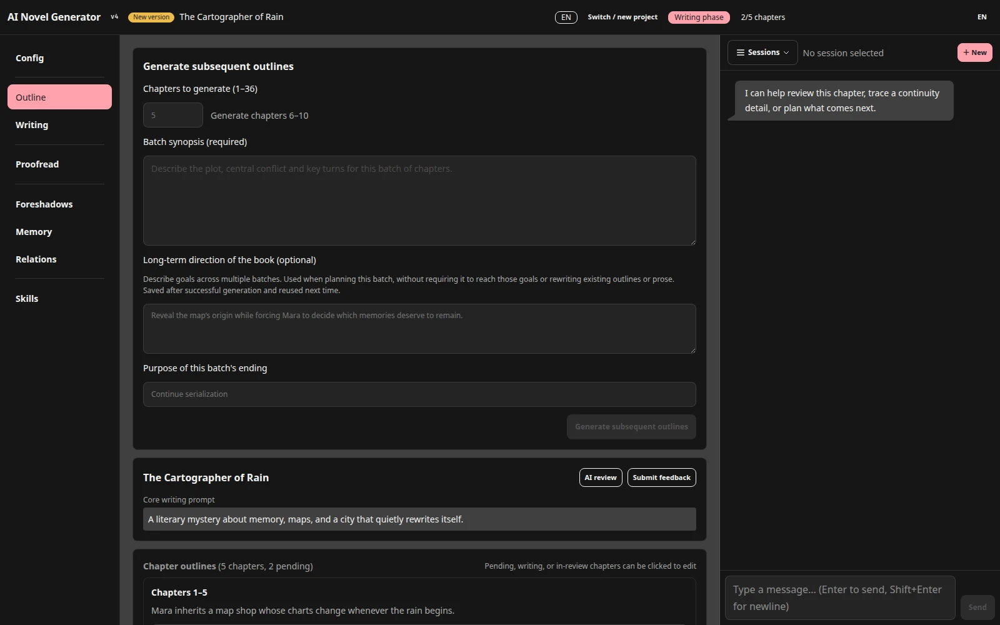

[English](README.md) · [简体中文](README.zh.md)

<p align="center">
  
</p>

# Show Me The Story

<p align="center"><a href="docs/guide.en.md">User guide</a> · <a href="https://github.com/Nigh/show-me-the-story/releases">Download releases</a></p>

A local application for writing long fiction with AI. One executable and a browser interface connect to an OpenAI-compatible model service to manage settings, plan batches of chapters, draft and revise prose, and export your work.

**The complete application ships as a single executable under 5 MB**—small enough to download, move, and keep anywhere.

You decide the story’s rules and direction. Those rules may be realistic or entirely fictional.





## First run

1. Download a release for your system, extract it into a directory you intend to keep, and launch it.
2. Open `http://localhost:48090` and create a Chinese or English project.
3. In Configuration, enter the API address, model identifier, and API key. Test the connection and save. Use the exact model identifier supplied by your provider.
4. Save the genre, target chapter length, style, and point of view. Add essential characters and worldview entries.
5. In Outline, enter a synopsis and chapter count (1–36) for the first batch. Generate and review it. If the page offers Confirm outline, confirm before writing.
6. In Writing, generate one chapter, read and revise it, then accept it before continuing.

Start with a small batch and auto-confirm disabled to check the voice, characters, and model behavior.

The [first-story walkthrough](docs/guide.en.md#first-story) explains the input, expected result, and next step for each stage.

## Find the right workflow

| Goal | Guide |
|---|---|
| Connect a model and configure context/output limits | [Setup](docs/guide.en.md#setup) |
| Start a novel from an idea | [First story](docs/guide.en.md#first-story) |
| Add a story rule and correct the current chapter | [Knowledge and corrections](docs/guide.en.md#knowledge) |
| Edit a paragraph or revise a chapter | [Review and revision](docs/guide.en.md#revision) |
| Add chapters, replace an unwritten batch, plan an ending | [Batch planning](docs/guide.en.md#planning) |
| Understand facts, settings, and foreshadowing | [Consistency](docs/guide.en.md#consistency) |
| Import an existing work or create a sequel | [Import and continuation](docs/guide.en.md#import) |
| Proofread, export, and back up | [Completion](docs/guide.en.md#completion) · [Data](docs/guide.en.md#data) |
| Use skills and the assistant | [Skills and assistant](docs/guide.en.md#skills) |
| Resolve disabled buttons, failures, or incompatible projects | [Troubleshooting](docs/guide.en.md#troubleshooting) |

## Features

- Multiple projects; Chinese and English writing with independently switchable UI language.
- Batch outlines, long-term direction, ending intent, and planning reviews.
- Characters, worldview, organizations, relationship graphs, and story knowledge.
- Chapter drafting, review, paragraph editing, targeted revision, and optional auto-confirm.
- Extracted facts with source references, setting-change proposals, and foreshadow tracking.
- Save knowledge and revise a chapter: selected entries enter that request in full; later writing retrieves relevant entries.
- Existing-text import, optional writing/polishing skills, and a conversational assistant.
- Separate final proofreading, anchored reports, per-chapter proofreading undo, and continuation projects.
- Streaming output, logs, cancellation, local persistence, and text/outline/report exports.

Consistency checks primarily use your story context; they are not online research. Authors still need to review model output.

## Running and storing data

The default data directory is the working directory at launch. You can pass an **existing directory**:

```bash
./show-me-the-story
./show-me-the-story /path/to/existing/novels
```

On Windows, double-click the executable or run:

```powershell
.\show-me-the-story.exe "D:\Novels"
```

Check the project directory printed at startup. An invalid directory argument falls back to the working directory. The default port is 48090; override it with the `PORT` environment variable.

Projects live in `storys/<project>/`. Stop tasks and close the program before copying the entire data directory for backup or migration. This release only opens v4 projects. Use the version recommended by the project list for older formats; do not edit the format number manually.

After tasks finish, use **Back up ZIP** in the project list to download a complete project. **Restore a project backup** restores it as a new project without overwriting the original. Global API configuration and user Skills are excluded; preserve them separately when migrating. See [backups and restoration](docs/guide.en.md#data).

After an interrupted prose/progress save, reopening the project attempts to restore the last complete save. Damaged chapter files or failed recovery prevent the project from opening and display diagnostics. Preserve the entire project directory, including `progress.json.rollback` if present, then resolve file access problems or restore a backup. The rollback journal is not version history or a replacement for regular backups; do not run multiple writers against the same project.

Files are stored locally, but AI operations send relevant prose, settings, and prompts to your configured model service, which may charge for usage. API keys are stored in `api.json`; inspect shared files and logs for sensitive information. Use the application in a trusted local environment, not directly exposed to the public internet.

If Windows reports an unknown publisher, verify the download source. After deciding to trust the executable, use More info → Run anyway.

## Development

Go 1.25.1 with the standard library; Vite 5, Svelte 4, Tailwind CSS 4, DaisyUI 5, and `@xianii/design-system`. Frontend assets and built-in skills are embedded in the executable.

Install Go and Node.js, optionally [Task](https://taskfile.dev/):

```bash
task build
```

Or build manually:

```bash
cd frontend
npm install
npm run build
cd ..
go build -o show-me-the-story .
```

Use `task dev` for the backend and `task dev:frontend` for the frontend development server (5173, proxying API requests to 48090). Run `task screenshots` with Google Chrome installed to rebuild the README images from fixed offline sample data.

Checks:

```bash
go build ./...
go test ./...
go vet ./...
node frontend/src/lib/projectRestore.check.js
node frontend/src/lib/forceGraphLayout.check.js
```

See [AGENTS.md](AGENTS.md) for architecture and contribution constraints, and the [user guide](docs/guide.en.md) for workflows.

## License

[MIT](LICENSE)
