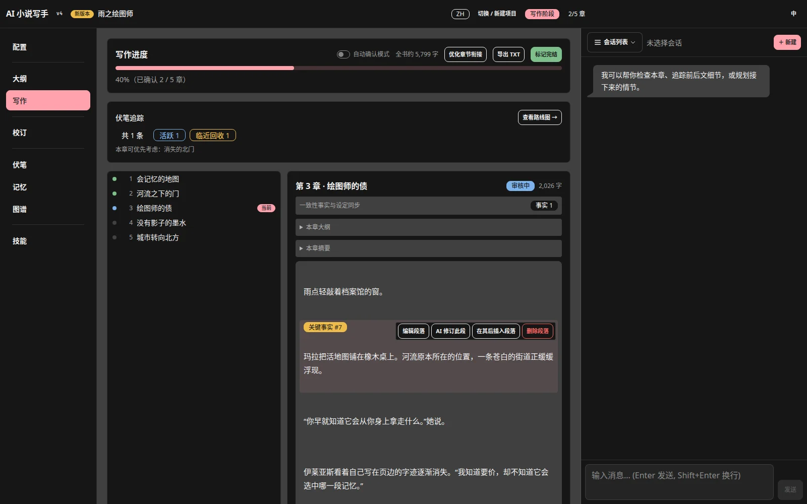
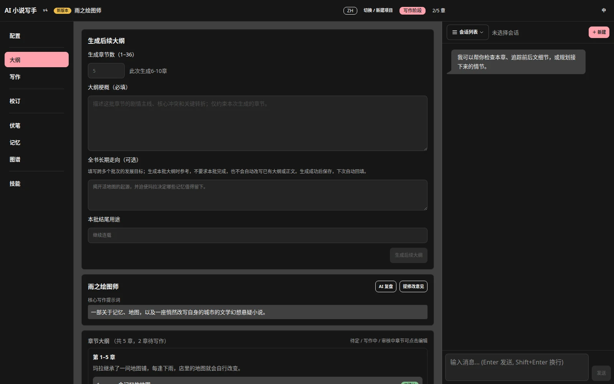

[English](README.md) · [简体中文](README.zh.md)

<p align="center">
  
</p>

# Show Me The Story — AI 小说写手

<p align="center"><a href="docs/guide.zh.md">完整使用指南</a> · <a href="https://github.com/Nigh/show-me-the-story/releases">下载发布版</a></p>

本地运行的长篇小说创作工具。一个可执行文件、一套浏览器界面，连接 OpenAI 兼容的模型接口，即可管理设定、分批规划大纲、逐章生成和修订，最后导出作品。

**完整应用仅为一个不到 5 MB 的可执行文件**，下载、移动和保存都很轻便。

你决定故事规则与创作方向，AI 负责协助执行。设定可以遵循现实，也可以完全虚构。





## 第一次使用

1. 下载适合系统的发布版，解压到准备长期保存作品的目录，启动程序。
2. 浏览器打开 `http://localhost:48090`，创建项目并选择中文或英文。
3. 在「配置」填写 API 地址、模型名称和 API Key，测试连接并保存。模型名称以服务商提供的标识为准。
4. 保存故事类型、每章目标字数、文风和视角，添加必要的角色与世界观。
5. 在「大纲」填写本批梗概和章数（1–36），生成并检查章纲；页面出现「确认大纲」时，确认后进入写作。
6. 在「写作」生成一章，阅读并修订，满意后确认，再继续下一章。

首次建议只规划少量章节并关闭自动确认，先验证人物、文风与模型输出是否符合预期。

遇到某一步不知道如何操作，请从[第一次创作](docs/guide.zh.md#first-story)开始；完整指南说明了每一步的输入、结果和下一步。

## 按需求查阅

| 你想做什么 | 使用说明 |
|---|---|
| 接通模型、设置窗口和输出长度 | [安装与 API 配置](docs/guide.zh.md#setup) |
| 从一个想法开始写小说 | [推荐创作流程](docs/guide.zh.md#first-story) |
| AI 写错规则，补充设定后修正本章 | [补充知识与纠错](docs/guide.zh.md#knowledge) |
| 只改一句、一个段落或某一章 | [审核与修订](docs/guide.zh.md#revision) |
| 追加章节、调整末批、安排结尾 | [分批规划](docs/guide.zh.md#planning) |
| 理解事实、设定、伏笔的区别 | [知识与一致性](docs/guide.zh.md#consistency) |
| 接着已有小说写，或开始续作 | [导入与续写](docs/guide.zh.md#import) |
| 完结后校订、导出、备份 | [完稿流程](docs/guide.zh.md#completion) · [数据管理](docs/guide.zh.md#data) |
| 配置技能，合理使用助理 | [技能与助理](docs/guide.zh.md#skills) |
| 按钮不可用、任务失败、版本不兼容 | [排查问题](docs/guide.zh.md#troubleshooting) |

## 核心能力

- 多项目与中英文创作；界面语言可以独立切换。
- 分批大纲、长期方向、结尾意图与规划复盘。
- 角色、世界观、组织、关系图谱和知识设定。
- 逐章生成、审核、段落编辑、定向修订与可选自动确认。
- 正文事实提取、来源定位、设定变化建议和伏笔跟踪。
- 补充知识后直接修订本章：所选条目完整进入本次请求，后续按相关性使用。
- 已有作品导入、可选写作与润色 Skill、聊天助理。
- 独立完稿校订、问题定位、逐章撤销校订与创建续写项目。
- 实时日志、流式输出、任务取消、本地保存与全文/大纲/报告导出。

一致性核查主要依据小说上下文，不等于联网查证。AI 仍可能遗漏或误用设定，需要作者审核。

## 运行与数据

默认数据目录是启动时的工作目录。也可传入一个**已经存在的目录**：

```bash
./show-me-the-story
./show-me-the-story /path/to/existing/novels
```

Windows 可双击可执行文件，或在 PowerShell 中运行：

```powershell
.\show-me-the-story.exe "D:\Novels"
```

请核对启动日志中的项目目录；指定目录不存在时程序会退回工作目录。端口由 `PORT` 环境变量覆盖，默认 48090。

项目保存在 `storys/<项目名>/`。迁移时停止任务、关闭程序，再复制整个数据目录。当前版本只打开 v4 项目；旧格式请使用项目列表提示的对应版本，勿手改版本号。

也可等待任务结束后，在项目列表点击「备份 ZIP」下载完整项目；使用「从项目备份恢复」恢复为新项目，不覆盖原项目。ZIP 不包含全局 API 配置和用户 Skill，迁移时需另行保留。详见[备份与恢复](docs/guide.zh.md#data)。

正文与进度保存中断后，重新打开项目会尝试恢复上次完整保存。若章节文件损坏或恢复失败，程序会阻止打开并提示诊断；请保留整个项目目录及 `progress.json.rollback`（若存在），排除文件访问问题或从备份恢复。回滚日志不能替代定期备份，也不是正文历史版本；不要用多个程序同时写同一项目。

正文和配置保存在本地，但使用 AI 功能时，相关正文、设定、提示词等会发送到你配置的模型服务；服务可能产生费用。API Key 位于本地 `api.json`，分享项目或日志前应检查敏感信息。程序适合可信本地环境，不要直接暴露到公网。

Windows 若提示未知发布者，请先确认下载来源；确认信任后可通过「更多信息 → 仍要运行」启动。

## 开发与构建

后端使用 Go 1.25.1 和标准库；前端使用 Vite 5、Svelte 4、Tailwind CSS 4、DaisyUI 5 与 `@xianii/design-system`。前端产物和内置 Skill 嵌入单个二进制。

安装 Go、Node.js；可选安装 [Task](https://taskfile.dev/)。

```bash
task build
```

或分步构建：

```bash
cd frontend
npm install
npm run build
cd ..
go build -o show-me-the-story .
```

开发命令：`task dev` 启动后端，`task dev:frontend` 启动前端开发服务器（5173，代理 API 到 48090）。安装 Google Chrome 后，运行 `task screenshots` 可用固定离线样例重建 README 截图。

检查：

```bash
go build ./...
go test ./...
go vet ./...
node frontend/src/lib/projectRestore.check.js
node frontend/src/lib/forceGraphLayout.check.js
```

架构与贡献约束见 [AGENTS.md](AGENTS.md)。用户操作说明以[完整指南](docs/guide.zh.md)为准。

## 许可证

[MIT](LICENSE)
